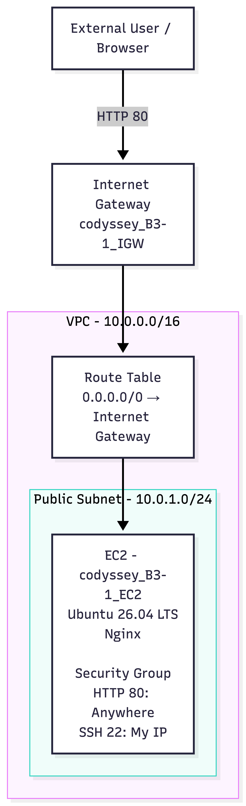
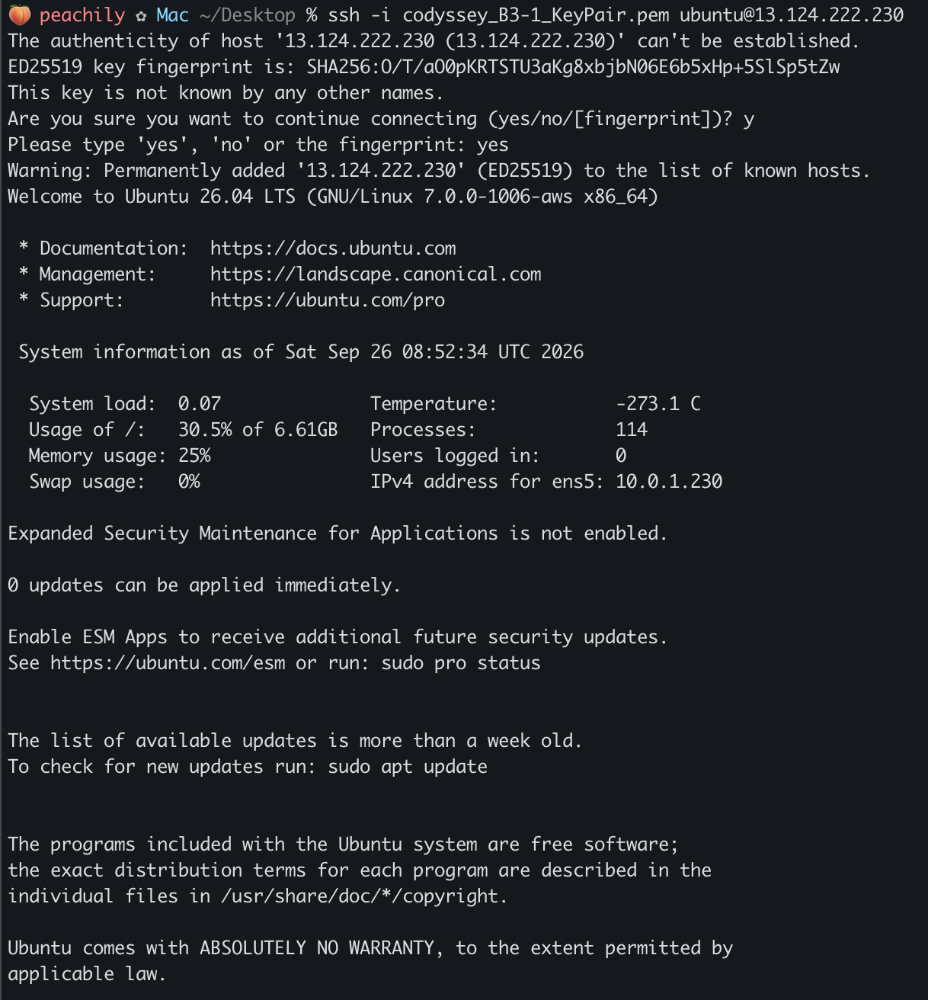
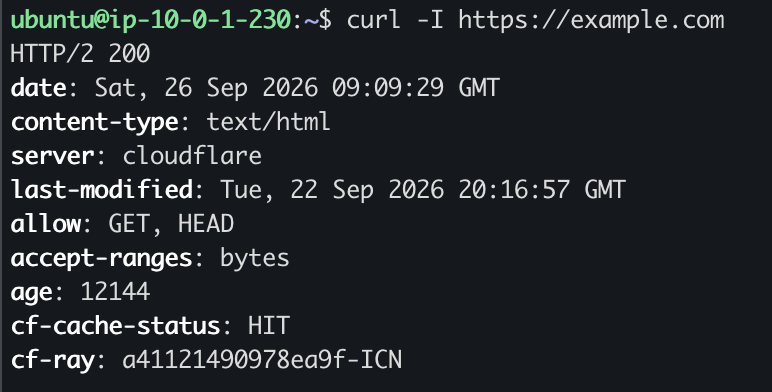
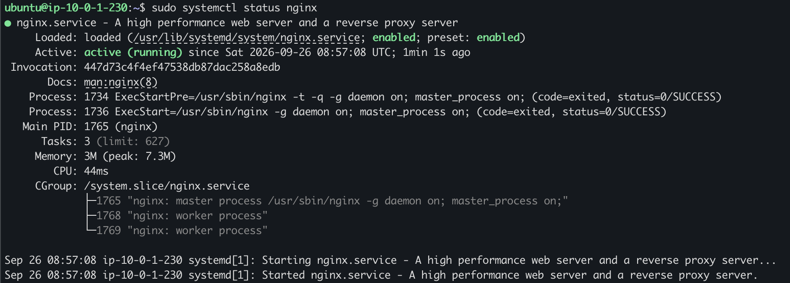
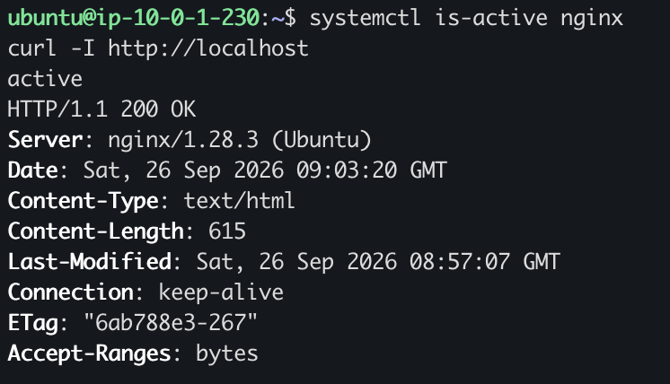
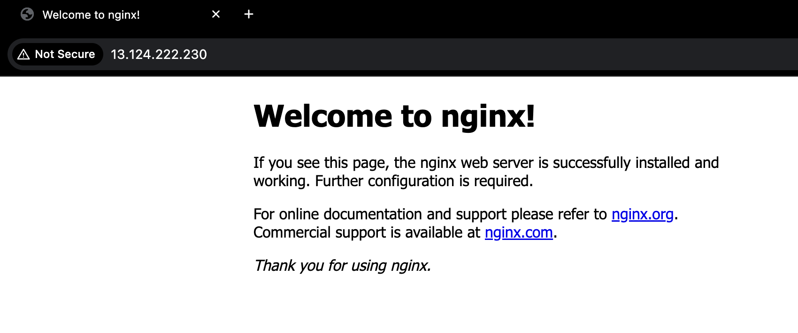

# B3-1 AWS 웹 서비스 인프라 구축

- AWS VPC 기반 웹 서비스 인프라 구축
- EC2 Ubuntu 서버에 Nginx 배포
- 네트워크·보안·IAM 최소 권한 구성 및 외부 접속 검증

---

## 1. AWS 구성
- **Region**: `ap-northeast-2` (서울)
- **VPC**: `10.0.0.0/16`
- **Public Subnet**: `10.0.1.0/24`
- **Internet Gateway**: VPC와 인터넷 연결
- **Route Table**: `0.0.0.0/0 → Internet Gateway`
- **EC2**: `t3.micro`, Ubuntu 26.04 LTS
- **Web Server**: Nginx
- **Security Group**
  - HTTP 80: `0.0.0.0/0`
  - SSH 22: My IP
- **IAM**: EC2/VPC 구성에 필요한 최소 권한 적용

---

## 2. 구축 및 동작 확인

### 2-1. EC2 SSH 접속
- Mac에서 키 페어를 이용하여 EC2 Ubuntu 서버에 SSH 접속
- `Welcome to Ubuntu 26.04 LTS` 확인
- EC2 내부 IP `10.0.1.230` 확인

### 2-2. 인터넷 아웃바운드 통신 확인
- `curl -I https://example.com`
- `HTTP/2 200` 응답 확인
- EC2 → Route Table → Internet Gateway → 인터넷 통신 정상 확인

### 2-3. Nginx 실행 확인
- `sudo systemctl status nginx`
- `active (running)` 상태 확인
- Nginx 웹 서버 정상 실행 확인

### 2-4. EC2 내부 웹 서비스 확인
- `systemctl is-active nginx` → `active`
- `curl -I http://localhost` → `HTTP/1.1 200 OK`
- EC2 내부에서 Nginx 웹 서비스 정상 응답 확인

### 2-5. 외부 접속 확인
- **검증 방식**: A - 브라우저 접속
- **URL**: `http://<PUBLIC_IP>`
- **결과**: Nginx 기본 페이지 정상 표시

---

## 3. 리소스 정리 및 트러블슈팅
- 발생한 오류 및 해결 과정 기록: [트러블슈팅 보고서](docs/troubleshooting.md)
- 실습 종료 후 생성한 AWS 리소스 정리: [리소스 정리 체크리스트](docs/cleanup-checklist.md)
