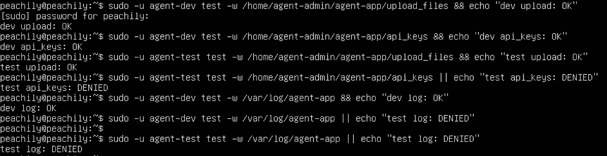
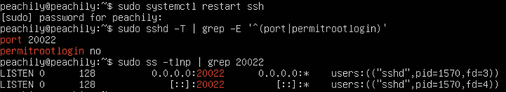
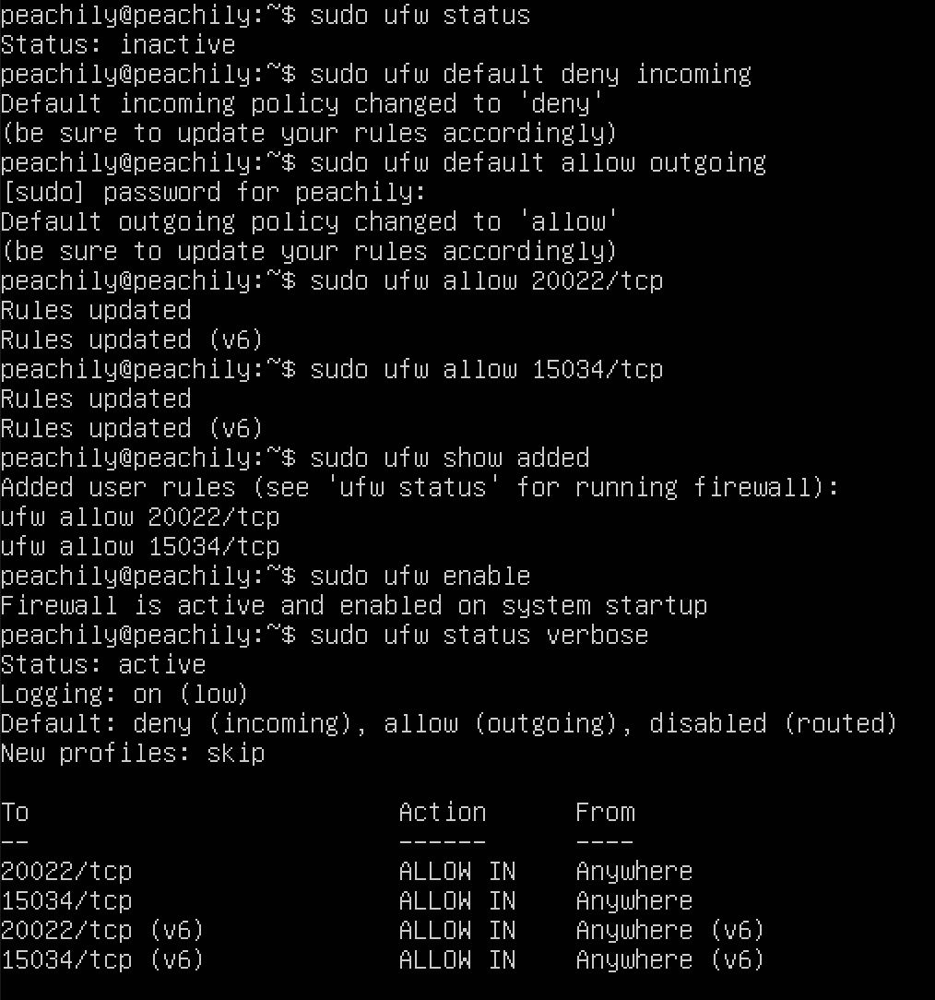
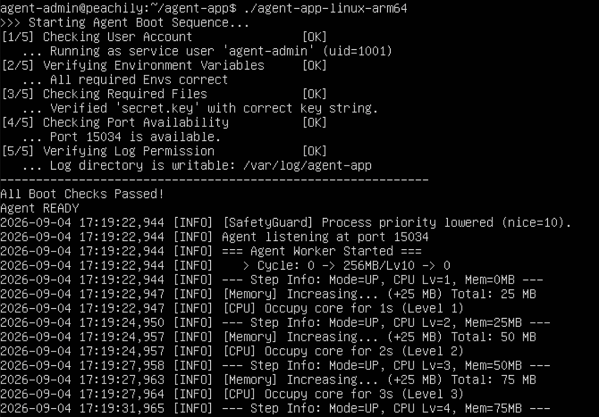
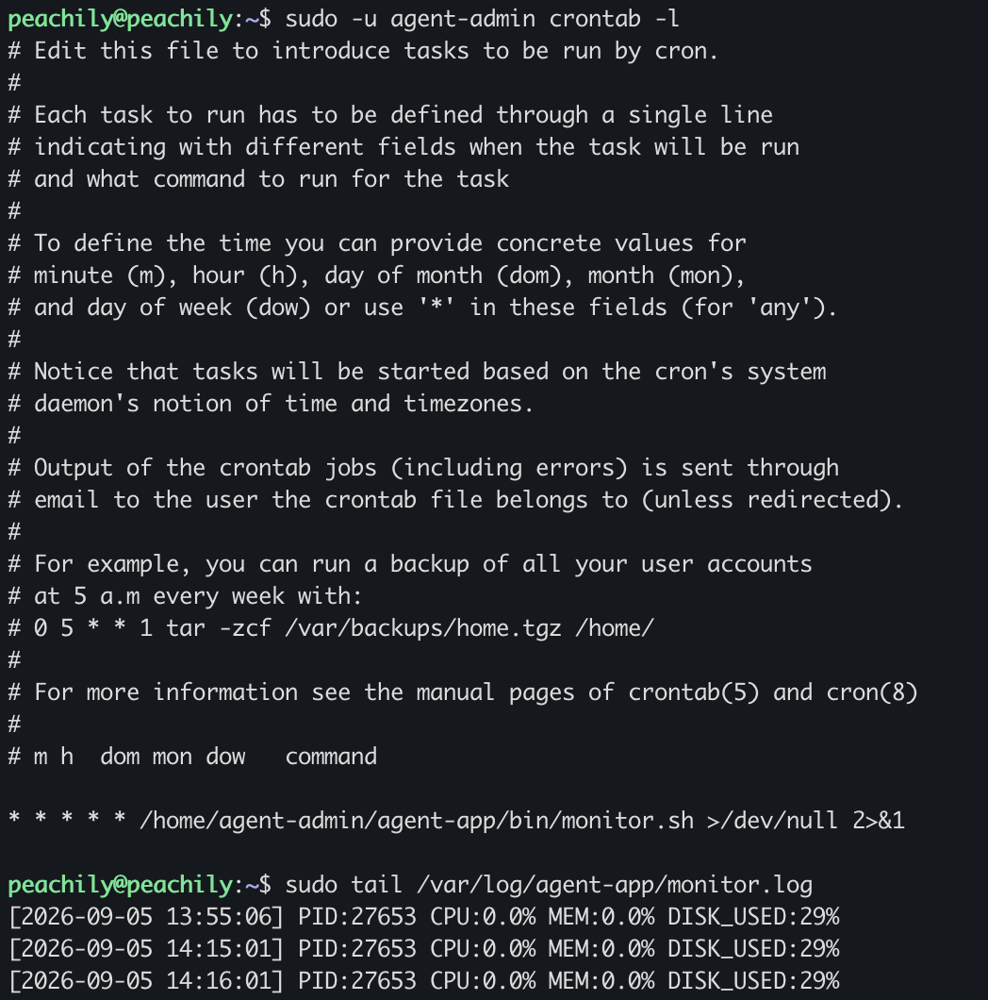

# Codyssey AI Tools - Linux 서버 운영 및 모니터링

Ubuntu 환경에서 계정·그룹 및 디렉터리 권한을 구성하고, SSH와 방화벽을 설정한 뒤 Agent 앱을 실행하였다.  
또한 Bash 기반 `monitor.sh`를 작성하여 Agent 프로세스와 포트, 시스템 자원을 확인하고 `cron`을 이용해 모니터링을 자동화하였다.

## 1. 실행 환경

- Ubuntu 22.04.5 LTS
- ARM64 (`aarch64`)
- Agent 실행 파일: `agent-app-linux-arm64`
- `AGENT_HOME`: `/home/agent-admin/agent-app`
- Agent Port: `15034`

## 2. 계정 및 그룹 구성

| 계정 | 그룹 |
|---|---|
| `agent-admin` | `agent-common`, `agent-core` |
| `agent-dev` | `agent-common`, `agent-core` |
| `agent-test` | `agent-common` |

디렉터리는 다음과 같이 구성하였다.

```text
/home/agent-admin/agent-app/
├── agent-app-linux-arm64
├── bin/
│   └── monitor.sh
├── upload_files/
└── api_keys/
    └── secret.key

/var/log/agent-app/
└── monitor.log
```

- `upload_files`: `agent-common` 그룹 R/W
- `api_keys`: `agent-core` 그룹 R/W
- `/var/log/agent-app`: `agent-core` 그룹 R/W
- `/home/agent-admin`에는 `agent-common`의 디렉터리 접근을 위한 ACL 적용

접근 권한 테스트를 통해 `agent-dev`와 `agent-test`에 설정된 권한이 정상적으로 적용되는 것을 확인하였다.



## 3. SSH 및 방화벽 설정

SSH 포트를 `20022`로 변경하고 root 원격 로그인을 비활성화하였다.

```text
Port 20022
PermitRootLogin no
```

설정 적용 후 실제 SSH 서비스가 TCP `20022` 포트에서 LISTEN 상태인 것을 확인하였다.



UFW는 기본적으로 inbound 연결을 차단하고 outbound 연결을 허용하도록 설정하였다.  
Inbound는 TCP `20022`, `15034` 포트만 허용하였다.

```text
Status: active
Default: deny (incoming), allow (outgoing)

20022/tcp  ALLOW IN
15034/tcp  ALLOW IN
```



## 4. Agent 앱 실행

다음 환경 변수를 설정하였다.

```bash
AGENT_HOME=/home/agent-admin/agent-app
AGENT_PORT=15034
AGENT_UPLOAD_DIR=$AGENT_HOME/upload_files
AGENT_KEY_PATH=$AGENT_HOME/api_keys
AGENT_LOG_DIR=/var/log/agent-app
```

API Key 파일을 지정된 위치에 생성하고, Agent 앱은 `agent-admin` 계정으로 실행하였다.

Boot Sequence의 모든 항목이 정상적으로 완료된 후 다음 상태를 확인하였다.

```text
All boot checks passed
Agent READY
```



## 5. monitor.sh

`$AGENT_HOME/bin/monitor.sh`를 작성하고 다음과 같이 권한을 설정하였다.

```text
owner: agent-dev
group: agent-core
mode: 750
```

`monitor.sh`는 다음 항목을 확인하도록 구현하였다.

- Agent 프로세스 실행 여부
- TCP `15034` LISTEN 여부
- UFW 활성화 여부
- CPU 사용률
- 메모리 사용률
- 루트 파티션 디스크 사용률
- CPU 20%, MEM 10%, DISK 80% 초과 시 `[WARNING]` 출력
- 프로세스 또는 포트 확인 실패 시 `exit 1`
- 실행 결과를 `/var/log/agent-app/monitor.log`에 누적 기록
- 로그 크기가 10MB 이상일 경우 최대 10개 파일이 유지되도록 로그 로테이션

전체 소스코드는 [`monitor.sh`](./monitor.sh)에서 확인할 수 있다.

로그는 다음 형식으로 기록된다.

```text
[YYYY-MM-DD HH:MM:SS] PID:<PID> CPU:<CPU>% MEM:<MEM>% DISK_USED:<DISK>%
```

## 6. cron 자동 실행

`agent-admin`의 crontab에 다음 작업을 등록하였다.

```cron
* * * * * /home/agent-admin/agent-app/bin/monitor.sh >/dev/null 2>&1
```

`monitor.sh`가 1분마다 실행되며, `monitor.log`에 새로운 기록이 누적되는 것을 확인하였다.



## 7. 요구사항 수행 결과

| 요구사항 | 결과 |
|---|---|
| SSH Port `20022` | 완료 |
| root 원격 로그인 비활성화 | 완료 |
| UFW 활성화 및 `20022/tcp`, `15034/tcp` 허용 | 완료 |
| 계정 및 그룹 구성 | 완료 |
| 디렉터리 권한 및 ACL 구성 | 완료 |
| Agent Boot Sequence 및 `Agent READY` 확인 | 완료 |
| TCP `15034` LISTEN 확인 | 완료 |
| `monitor.sh` 구현 | 완료 |
| CPU / MEM / DISK 및 WARNING 처리 | 완료 |
| `monitor.log` 기록 | 완료 |
| 10MB / 최대 10개 로그 로테이션 구현 | 완료 |
| `agent-admin` crontab 매분 실행 | 완료 |
| `monitor.log` 누적 확인 | 완료 |
