# B4-2 Linux 장애 분석

`agent-leak-app-arm64`에서 OOM, CPU 임계치 초과, Deadlock 장애를 재현하고
로그 및 시스템 상태를 분석하여 원인과 조치 결과를 확인하였다.

---

## 1. OOM / Memory Leak

### Before

- 설정: `MEMORY_LIMIT=100`
- Heap 사용량: `25MB → 50MB → 75MB → 100MB`
- `MemoryGuard`에서 메모리 한계 초과 감지
- 프로세스 Self-termination 발생

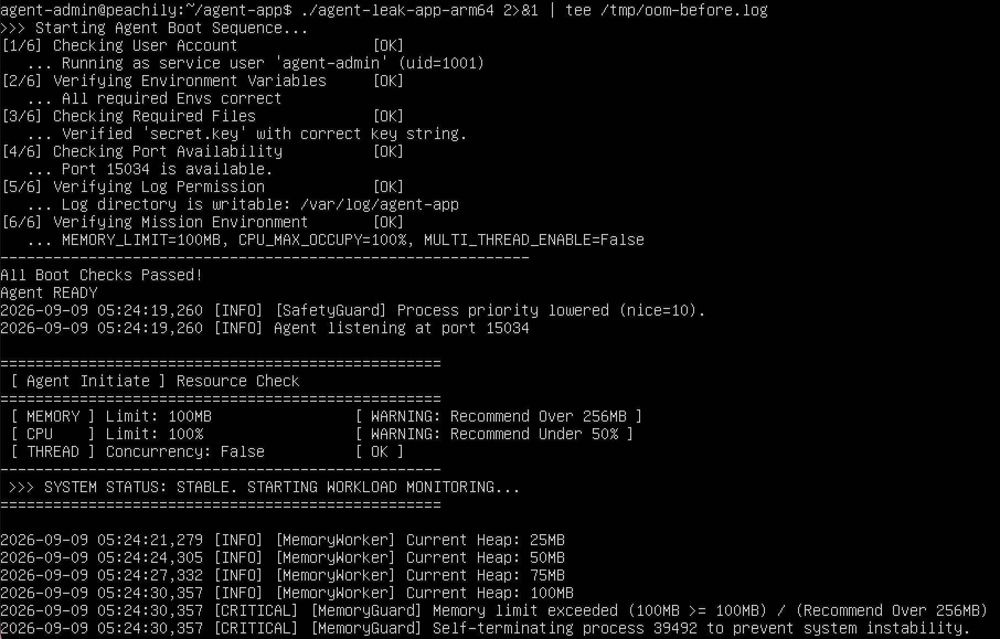

**관제 결과**
- 실제 메모리 사용량: `17.4MB → 42.6MB → 67.6MB → 92.6MB`
- 지속적인 메모리 증가 확인

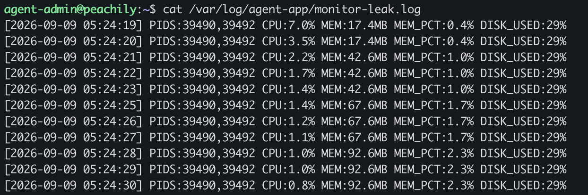

### After

- 설정 변경: `MEMORY_LIMIT=100 → 200`
- Heap이 200MB에 도달할 때까지 프로세스 유지
- 기존보다 종료 시점 지연

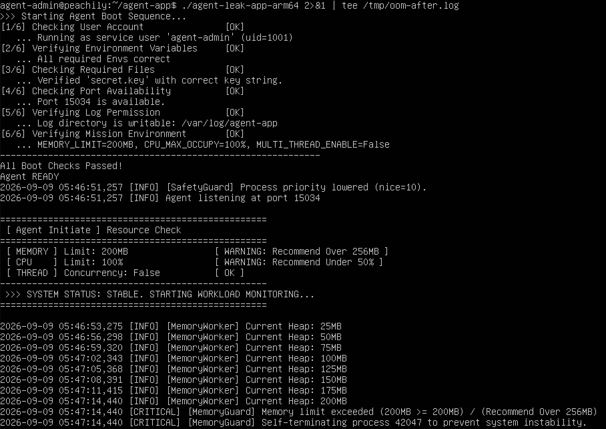

**관제 결과**
- 실제 메모리 사용량: `17.4MB → 192.6MB`
- 제한값 상향 후에도 메모리 증가 지속

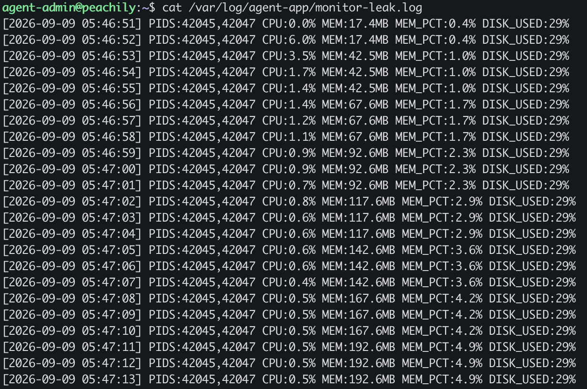

**분석**
- 원인: 지속적인 메모리 할당으로 설정 한계 도달
- 조치: `MEMORY_LIMIT` 상향
- 결과: 종료 시점은 지연되지만 메모리 증가 자체는 해결되지 않음

---

## 2. CPU Threshold / Process Termination

### Before

- 설정: `CPU_MAX_OCCUPY=100`
- 내부 `Current Load`: 최대 `50.76%`
- `CPU Threshold Violated` 발생
- 프로세스 종료

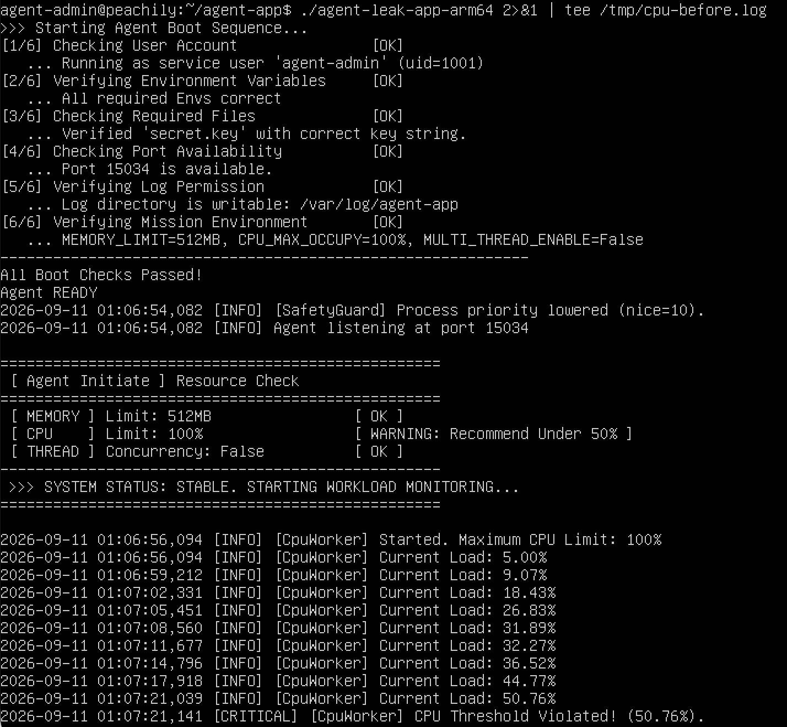

**관제 결과**
- OS에서 측정한 실제 CPU 사용률은 낮은 수준
- `Current Load`는 실제 CPU 사용률이 아닌 애플리케이션 내부 시나리오 값으로 확인

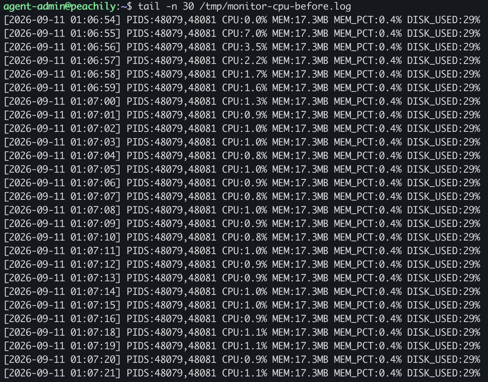

**SIGTERM 검증**
- `strace` 결과: `tgkill(49613, 49613, SIGTERM)`
- 임계치 초과 후 자기 프로세스를 대상으로 SIGTERM 발생 확인

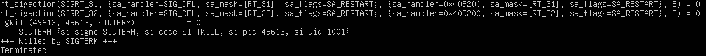

### After

- 설정 변경: `CPU_MAX_OCCUPY=100 → 30`
- 내부 부하 30% 도달 시 cooldown 시작
- 약 5%까지 감소 후 다시 증가
- 프로세스 종료 없이 동작 지속

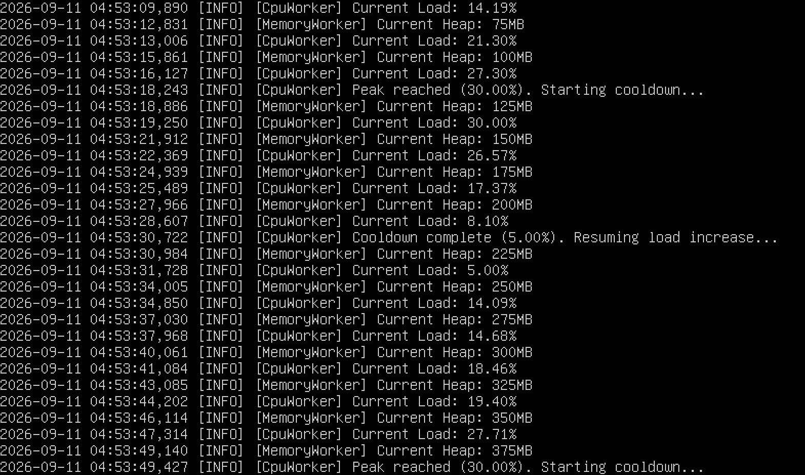

**관제 결과**
- 실제 CPU 사용률: 약 `0.8~0.9%`
- 프로세스 정상 유지

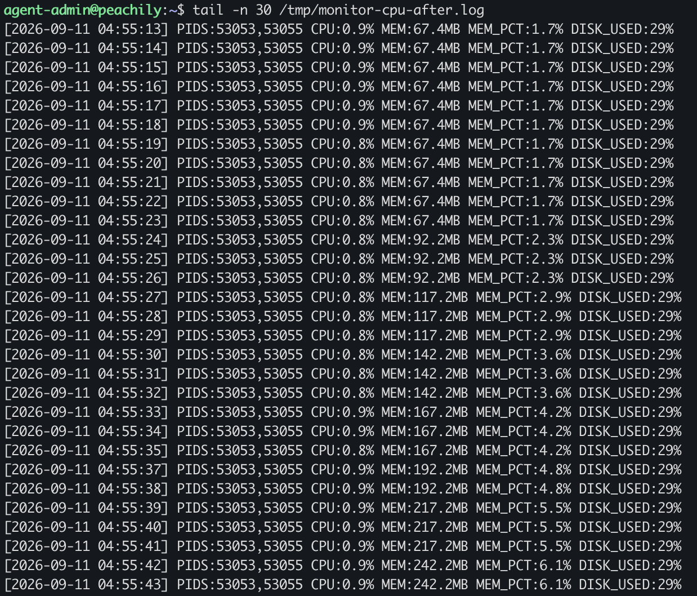

**분석**
- 원인: 내부 부하 시나리오가 안전 임계치를 초과하여 종료 동작 발생
- 조치: `CPU_MAX_OCCUPY=30`으로 하향
- 결과: 임계치 초과 대신 cooldown 동작, 프로세스 정상 유지

---

## 3. Deadlock

### Before

- 설정: `MULTI_THREAD_ENABLE=true`
- Thread-1: `Shared_Memory_A` 획득 → `Socket_Pool_B` 대기
- Thread-2: `Socket_Pool_B` 획득 → `Shared_Memory_A` 대기
- 두 스레드 모두 `WAITING ... BLOCKED`
- 작업 진행 중단

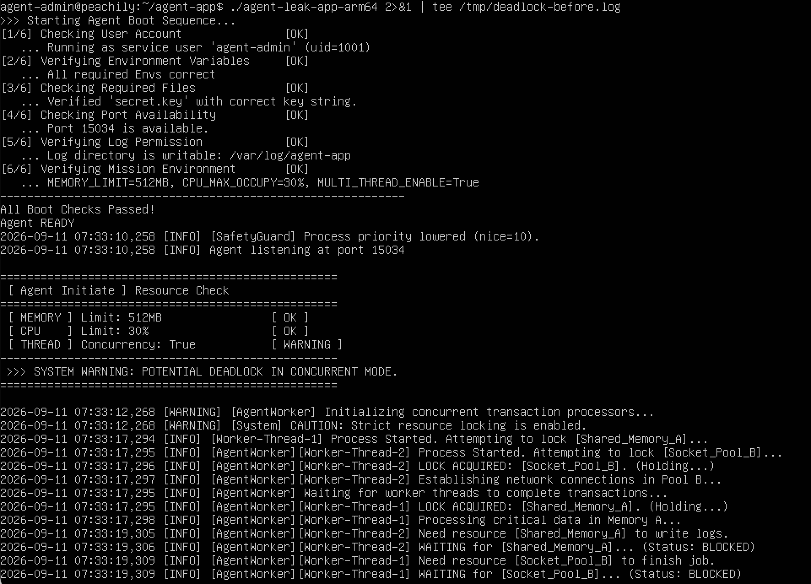

**프로세스 / 스레드 확인**
- PID `60151`, `60162` 계속 존재
- 스레드 `%CPU=0.0`
- `S/SN` 대기 상태 확인
- 프로세스는 살아 있으나 작업은 진행되지 않음

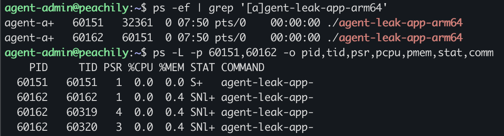

### After

- 설정 변경: `MULTI_THREAD_ENABLE=true → false`
- `WAITING ... BLOCKED` 미발생
- 작업 로그 정상 진행

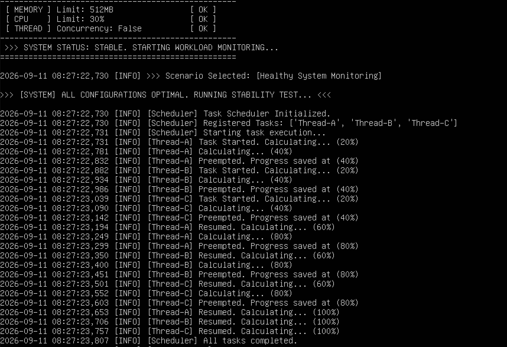

**관제 결과**
- 프로세스 정상 유지
- 메모리 사용량: `267.2MB → 517.3MB`
- 작업이 정체되지 않고 계속 진행됨

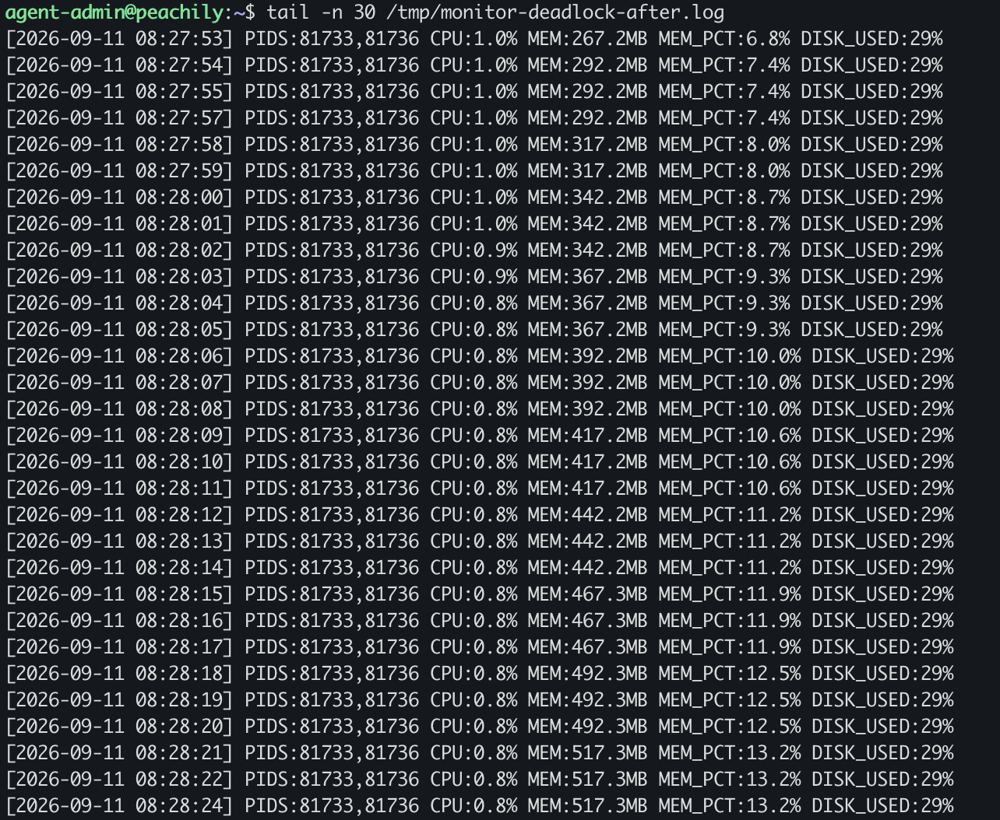

**분석**
- 원인: 두 스레드 간 Lock의 순환 대기
- 조치: `MULTI_THREAD_ENABLE=false`
- 결과: 교착 상태 해소 및 정상 진행 확인
